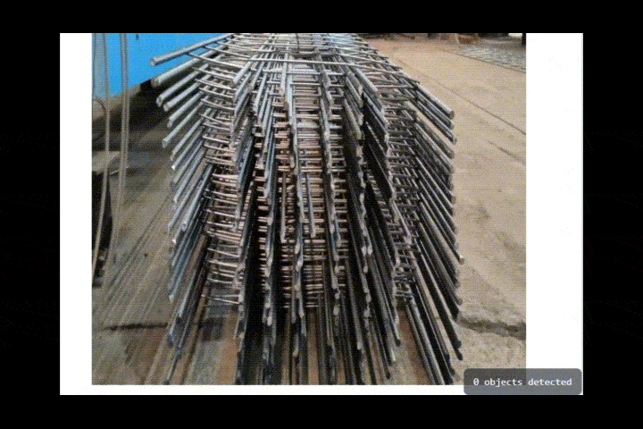

# IA North - Dashboard de Análise de Visão Computacional


Dashboard em tempo real para visualização de dados gerados por modelos de Inteligência Artificial da IANorth. A primeira aplicação deste dashboard é o monitoramento da contagem de vergalhões em lotes de produção.


*(Nota: Este GIF é um placeholder da visualização final do produto.)*

---

## ✨ Funcionalidades

- **Visualização em Tempo Real**: Interface reativa que exibe dados atualizados da contagem (atualmente simulados).
- **Layout Profissional**: Design de duas colunas com feed de vídeo e painel de análise de dados.
- **Painel de Análise**: Exibe a contagem atual, a meta do lote, o status da operação e o progresso percentual.
- **Design System Padronizado**: Cores e estilos definidos como *tokens* no Tailwind CSS para garantir consistência visual e fácil manutenção.
- **Componentização**: Interface construída com componentes React reutilizáveis e bem definidos.

---

## 🛠️ Tecnologias Utilizadas

Este projeto foi construído utilizando as seguintes tecnologias:

- **[React](https://reactjs.org/)**: Biblioteca para construção da interface de usuário.
- **[TypeScript](https://www.typescriptlang.org/)**: Superset do JavaScript que adiciona tipagem estática.
- **[Vite](https://vitejs.dev/)**: Ferramenta de build moderna e extremamente rápida.
- **[Tailwind CSS](https://tailwindcss.com/)**: Framework CSS utility-first para estilização.
- **[React Icons](https://react-icons.github.io/react-icons/)**: Biblioteca para inclusão de ícones SVG.

---

## 🚀 Como Executar o Projeto

Siga os passos abaixo para configurar e executar o ambiente de desenvolvimento local.

**Pré-requisitos:**
- [Node.js](https.nodejs.org/en/) (versão 18.x ou superior)
- [npm](https://www.npmjs.com/) ou [Yarn](https://yarnpkg.com/)

**1. Clone o repositório:**
```bash
git clone git@github.com:SEU_USUARIO/IaNorth-web.git
cd IaNorth-web
```

**2. Instale as dependências do projeto:**
```bash
npm install
```

**3. Execute o servidor de desenvolvimento:**
```bash
npm run dev
```

Após executar o comando, a aplicação estará disponível em `http://localhost:5173` (ou na porta indicada no seu terminal).

---

## 📂 Estrutura de Pastas

O projeto segue uma estrutura de pastas simples e organizada para facilitar a navegação e manutenção do código:

```
IaNorth-web/
├── public/              # Arquivos estáticos (imagens, fontes, etc.)
├── src/
│   ├── components/      # Componentes React reutilizáveis
│   │   ├── AnalysisPanel.tsx
│   │   └── VideoFeed.tsx
│   ├── App.tsx          # Componente principal da aplicação
│   ├── index.css        # Estilos globais e diretivas do Tailwind
│   └── main.tsx         # Ponto de entrada da aplicação
├── .gitignore           # Arquivos e pastas ignorados pelo Git
├── package.json         # Dependências e scripts do projeto
├── tailwind.config.js   # Arquivo de configuração do Tailwind CSS
└── README.md            # Este arquivo
```

---

## 🎨 Sistema de Design (Design System)

Para manter a consistência visual, utilizamos um sistema de tokens de design definidos no arquivo `tailwind.config.js`. Todas as cores da aplicação são padronizadas com nomes semânticos.

**Exemplo de uso:**
- Em vez de `bg-gray-900`, use `bg-background-primary`.
- Em vez de `text-blue-400`, use `text-accent-primary`.

Consulte o objeto `theme.extend.colors` no arquivo `tailwind.config.js` para ver todos os tokens de cores disponíveis.

---

## 🔜 Próximos Passos

- [ ] Conectar a interface com a API do backend para consumir dados reais.
- [ ] Substituir o placeholder do vídeo por um stream de vídeo ao vivo (via MJPEG, HLS ou WebRTC).
- [ ] Implementar WebSockets ou Server-Sent Events (SSE) para atualizações de dados em tempo real sem a necessidade de polling.
- [ ] Criar componentes de visualização de dados mais complexos (gráficos de histórico, logs de eventos).
- [ ] Adicionar testes unitários e de integração.

---

## 📄 Licença

Este projeto é de propriedade da IANorth Tecnologia. Todos os direitos reservados.
